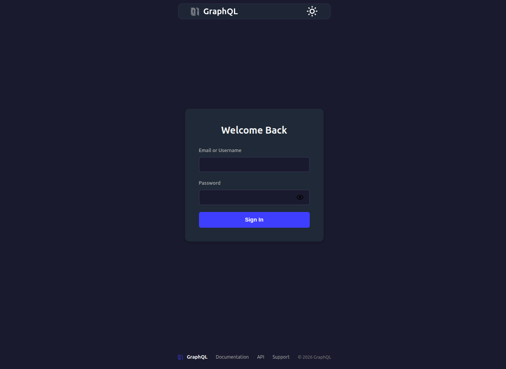
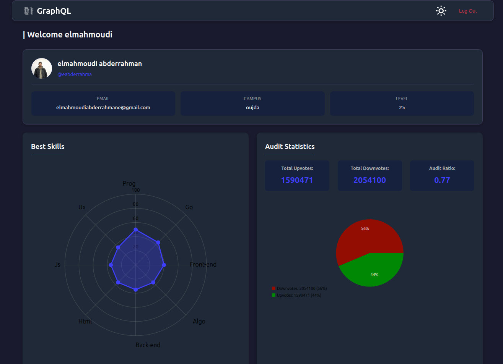
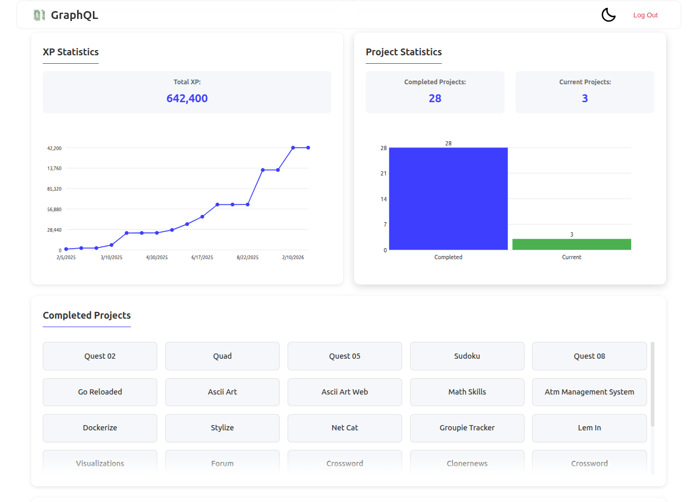

# GraphQL Student Dashboard

A modern, single-page web application that provides students at Zone01 with a visual dashboard to track their progress, skills, and project statistics using GraphQL API integration.


##  Table of Contents

- [Overview](#overview)
- [Architecture](#architecture)
- [Project Structure](#project-structure)
- [Features](#features)
- [Tech Stack](#tech-stack)
- [Getting Started](#getting-started)
- [API Integration](#api-integration)
- [Components](#components)
- [Screenshots](#screenshots)

---

## Overview

This project is a student dashboard that retrieves data from the Zone01 GraphQL API and presents it in an intuitive, visual format. It allows students to view their profile information, track their skills, monitor XP progress, and view project completion statistics.

---

## Architecture

The application follows a **modular component-based architecture** using vanilla JavaScript ES6 modules. It implements a clean separation of concerns with distinct layers for API communication, UI rendering, and utility functions.

### High-Level Architecture

```
┌─────────────────────────────────────────────────────────────┐
│                        index.html                            │
│                   (Entry Point)                              │
└─────────────────────────────────────────────────────────────┘
                              │
                              ▼
┌─────────────────────────────────────────────────────────────┐
│                      app.js                                 │
│               (Main Application Logic)                      │
│  - Authentication check                                      │
│  - Theme initialization                                     │
│  - View routing                                             │
└─────────────────────────────────────────────────────────────┘
                              │
              ┌───────────────┼───────────────┐
              ▼               ▼               ▼
┌──────────────────┐  ┌──────────────────┐  ┌──────────────────┐
│   API Layer      │  │  Components      │  │    Utils         │
│  ─────────────   │  │  ────────────    │  │  ──────────      │
│  - client.js     │  │  - auth/         │  │  - jwt.js        │
│  - queries.js    │  │  - profile/      │  │  - theme.js      │
│                  │  │  - graphs/       │  │  - popup.js      │
│                  │  │  - header/       │  │                  │
│                  │  │  - footer/       │  │                  │
└──────────────────┘  └──────────────────┘  └──────────────────┘
              │               │               │
              └───────────────┼───────────────┘
                              ▼
┌─────────────────────────────────────────────────────────────┐
│                    GraphQL API                              │
│              (zone01oujda.ma)                               │
└─────────────────────────────────────────────────────────────┘
```

### Data Flow

1. **User signs in** → JWT token stored in localStorage
2. **App initializes** → Checks authentication status
3. **Profile loads** → Fetches user data via GraphQL query
4. **Data rendering** → Components render charts and statistics
5. **Real-time updates** → Storage event listeners handle auth/theme changes

---

## Project Structure

```
GraphQL-V2/
├── public/
│   ├── index.html                 # Main HTML entry point
│   └── static/
│       ├── css/
│       │   └── style.css          # Global styles
│       ├── js/
│       │   ├── app.js             # Application initialization
│       │   ├── script.js          # Entry script (bootstraps app)
│       │   ├── api/
│       │   │   ├── client.js      # GraphQL fetch wrapper
│       │   │   └── queries.js     # GraphQL query definitions
│       │   ├── components/
│       │   │   ├── auth/
│       │   │   │   ├── signinView.js         # Sign-in page UI
│       │   │   │   └── signinValidation.js   # Form validation
│       │   │   ├── profile/
│       │   │   │   └── profileView.js        # User profile dashboard
│       │   │   ├── graphs/
│       │   │   │   ├── barGraph.js           # Bar chart component
│       │   │   │   ├── lineGraph.js          # Line chart component
│       │   │   │   ├── pieChart.js          # Pie chart component
│       │   │   │   ├── donutGraph.js        # Donut chart component
│       │   │   │   └── spiderChart.js       # Radar/spider chart
│       │   │   ├── header/
│       │   │   │   └── header.js            # Navigation header
│       │   │   └── footer/
│       │   │       └── footer.js            # Page footer
│       │   └── utils/
│       │       ├── jwt.js         # JWT token management
│       │       ├── theme.js       # Theme toggle (dark/light)
│       │       └── popup.js       # Notification popups
│       └── svg/
│           └── 01.svg            # Logo asset
```

---

## Features

###  Authentication
- JWT-based sign-in system
- Secure token storage in localStorage
- Automatic session management
- Logout functionality

###  User Profile
- Display user avatar (image or initial)
- Personal information (name, email, campus, level)
- User statistics overview

###  Data Visualization
- **Spider Chart**: Top skills visualization
- **Bar Graph**: Project completion statistics
- **Line Graph**: XP progression over time
- **Pie Chart**: Audit ratio (upvotes/downvotes)

###  UI/UX
- Dark/Light theme toggle
- Responsive design
- Loading states with spinners
- Error handling with popup notifications

---

## Tech Stack

| Category | Technology |
|----------|------------|
| **Frontend** | Vanilla JavaScript (ES6 Modules) |
| **Styling** | Custom CSS |
| **Charts** | SVG-based custom components |
| **API** | GraphQL (zone01oujda.ma) |
| **Icons** | Boxicons |
| **Architecture** | Component-based SPA |

---

## Getting Started

### Prerequisites
- A modern web browser (Chrome, Firefox, Edge, Safari)
- Access to Zone01 network or VPN (for API access)

### Installation

1. Clone the repository:
```bash
git clone https://github.com/yourusername/GraphQL-V2.git
cd GraphQL-V2
```

2. Open the application:
```bash
# Using a simple HTTP server
python3 -m http.server 8000

# Or using Node.js
npx serve .
```

3. Open your browser and navigate to:
```
http://localhost:8000
```

### Usage

1. **Sign In**: Enter your Zone01 credentials on the login page
2. **View Dashboard**: After authentication, view your personalized dashboard
3. **Explore Data**: Navigate through different sections (skills, XP, projects)
4. **Toggle Theme**: Click the sun/moon icon to switch between light and dark themes
5. **Logout**: Click the logout button to end your session

---

## API Integration

### Endpoint
```
https://learn.zone01oujda.ma/api/graphql-engine/v1/graphql
```

### Authentication
All requests require a Bearer token in the Authorization header:
```javascript
Authorization: Bearer <jwt_token>
```

### Queries Used

The application uses the following GraphQL queries:
- User profile information
- Audit statistics (upvotes/downvotes)
- XP transactions
- Completed projects
- Current projects
- Skills data

---

## Components

### Graph Components (SVG-based)

All charts are built from scratch using SVG, providing:
- Lightweight implementation (no external chart libraries)
- Full customization control
- Consistent styling with the application

| Component | Description |
|-----------|-------------|
| `BarGraph` | Renders horizontal/vertical bars for comparative data |
| `LineGraph` | Renders line charts for trend data |
| `PieChart` | Renders circular charts for proportional data |
| `SpiderChart` | Renders radar charts for multi-axis data |

### UI Components

| Component | Description |
|-----------|-------------|
| `signinView` | Login form with validation |
| `profileView` | Main dashboard with all statistics |
| `header` | Navigation with logo and theme toggle |
| `footer` | Footer with copyright info |

---

## Screenshots

| Sign In | Dashboard | Skills |
|:-------:|:---------:|:------:|
|  |  |  |

---

## License

This project is licensed under the MIT License - see the LICENSE file for details.

---

## Acknowledgments

- Zone01 Oujda for providing the GraphQL API
- Boxicons for the icon library

